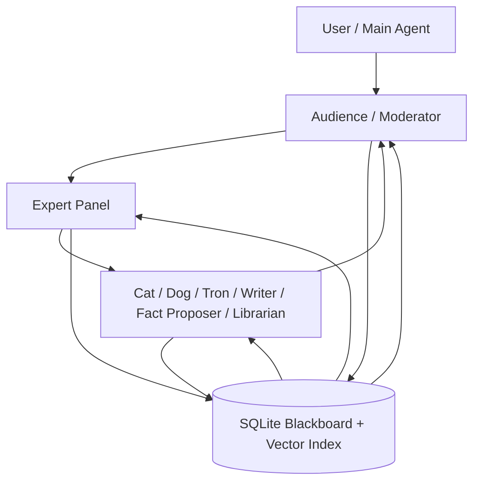
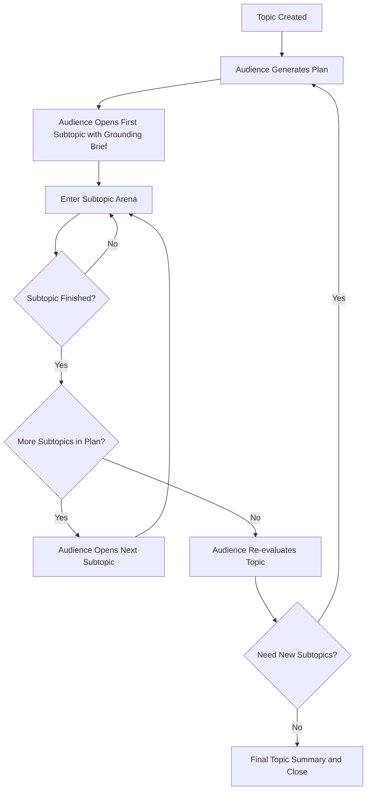
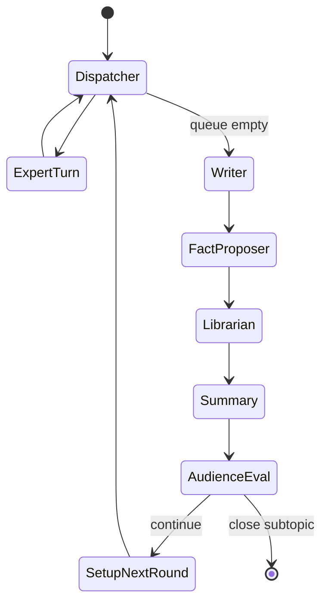

# GROX Chat System Design

## 1. 设计目标

本系统不是普通的多角色聊天程序，而是一个以本地数据库为中心的多代理科研推理系统。它的目标不是“让很多模型都说话”，而是让不同角色在可追踪、可检索、可纠偏、可终止的框架内，对一个复杂主题进行长期、高质量、低幻觉率的分布式推理。

系统必须同时满足以下目标：

- 用持久化黑板而不是脆弱的上下文窗口来承载长期状态。
- 用异构模型分工来控制成本，把贵模型留给高杠杆节点。
- 用显式 RAG 和异步纠偏机制压低幻觉和回音室效应。
- 用图式调度而不是自由对话，保证回合顺序、终止条件和纠错路径可控。
- 把讨论沉淀成可复用知识，而不是一次性对话垃圾。

## 2. 核心原则

### 2.1 DB-First Blackboard

数据库是系统的大脑，不是缓存。所有长期状态都必须写入本地黑板，模型只是在黑板周围读写、检索、总结和裁决。

### 2.2 Role Specialization

每个代理都有单一清晰职责。系统不依赖“一个万能模型自己想明白一切”，而依赖角色分工和回合结构。

### 2.3 Explicit Retrieval Before Generation

所有高质量发言都应先显式决定“我需要查什么”，再做检索、重排和生成。RAG 不是附加装饰，而是发言前置步骤。

### 2.4 Asynchronous Correction Instead of Hard Interception

系统不在每句话生成时同步拦截，而是在每轮末尾通过校验角色进行异步纠偏。这让讨论保持流动性，同时保留对低质量内容的惩戒能力。

### 2.5 Only Final Outputs Are Stored

隐藏推理、思维草稿、链路思考不进入共享上下文。进入数据库的只能是最终消息、结构化事实、总结与状态变化。

## 3. 系统总览

系统由四个平面构成：

1. **控制平面**：`Audience` 负责 topic 规划、subtopic 开场、阶段总结、终止判断与全局推进。
2. **推理平面**：专家组围绕当前 subtopic 进行回合制讨论。
3. **校验平面**：`Cat`、`Dog`、`Tron`、`Writer`、隐藏 `Fact Proposer`、`Librarian` 在每轮末尾进行奖励、惩戒、守法裁决、批评纠偏、候选事实提案和永久记忆审核。
4. **记忆平面**：数据库存储 topic、plan、subtopic、message、fact，以及向量索引，供后续 RAG 和终止判断使用。

## 4. 数据模型

### 4.1 Topic

`Topic` 是系统当前要解决的总问题，是讨论的最高层对象。一个 topic 应包含：

- `summary`：一句话概括主题。
- `detail`：更具体的任务说明或问题陈述。
- `status`：`Started` / `Running` / `Closed`。

### 4.2 Plan

`Plan` 是 Audience 为当前 topic 生成的子题队列或研究路线图。它定义系统接下来应依次处理哪些 subtopics，而不是让讨论在一个模糊大题上原地兜圈。

### 4.3 Subtopic

`Subtopic` 是系统在一个阶段内真正讨论的工作单元。一个 topic 可以对应多个 subtopics。每个 subtopic 都应有：

- `summary`
- `detail`
- `start_msg_id`
- `conclusion`

### 4.4 Message

`Message` 是所有角色对共享黑板的标准写入单元。消息包括：

- `sender`
- `content`
- `msg_type`

`msg_type` 至少包括：

- `standard`
- `summary`
- 可扩展的 `note` / `warning`

### 4.5 Fact

`Fact` 是经过 Librarian 审核后可复用的知识对象。它必须具备：

- `topic_id`
- `content`
- `source`

Fact 与普通 Message 的区别在于：它是给未来回合复用的稳定知识，而不是临时对话片段。

### 4.6 FactCandidate

`FactCandidate` 是隐藏 Fact Proposer 在轮末提出、等待 Librarian 审核的候选事实。它不是长期知识本身，而是进入永久记忆前的审稿队列。

每条 candidate 至少应包含：

- `topic_id`
- `subtopic_id`
- `writer_msg_id`
- `candidate_text`
- `status`
- `reviewed_text`
- `review_note`

### 4.6 Vector Memory

系统维护至少两类向量索引：

- `vec_facts`：供专家和校验者检索硬事实。
- `vec_messages`：供 summary RAG、循环检测和长期历史比较使用。

## 5. 角色体系

### 5.1 Audience

Audience 是系统的调度核心，而不是普通讨论成员。它负责：

- topic 级规划
- subtopic grounding brief
- 周期性 summary
- subtopic termination
- topic 级收束与再规划

Audience 的输出必须高度结构化，并且代表系统的管理决策。

### 5.2 Writer

Writer 是元评论家与纠偏者。它不负责主辩论，而负责：

- 对低质量、漂移或过度断言的内容提出批评
- 用较强但较便宜的 Gemini Flash 生成清晰的轮末批评意见

Writer 不再直接提出候选 Fact；它只负责“指出本轮哪里有问题”。

### 5.3 Librarian

Librarian 是永久记忆守门员。它负责：

- 逐条审核隐藏 Fact Proposer 提出的候选事实
- 判断事实应被 `accept`、`soften` 还是 `reject`
- 把通过审核的事实写入 Fact
- 把过强、过满、过于武断的句子改写成更保守的长期知识

Librarian 的原则是：宁可保守，也不让未经审稿的断言污染长期记忆。

### 5.4 Fact Proposer

Fact Proposer 是一个隐藏系统节点，不参与聊天室可见发言。它负责：

- 用 MiniMax research loop 产生少量候选 Fact
- 把候选事实直接写入 `FactCandidate`
- 避免把 fact proposal 混进 Writer critique 或 Audience summary

Fact Proposer 的输出是结构化候选事实，而不是聊天室消息。

### 5.5 Expert Panel

专家组负责构造主体推理：

- `Dreamer`：提出新方向、假设、可能性空间。
- `Scientist`：判断理论可行性、机制合理性。
- `Engineer`：把想法变成可实现架构、流程、实现路径。
- `Analyst`：给出量化视角、指标、数据解释。
- `Critic`：攻击漏洞、边界条件、逻辑断裂。
- `Contrarian`：系统性反对当前主流方向，迫使讨论突破共识陷阱。

### 5.6 Validation Roles

- `Cat`：寻找本轮最值得扩展的贡献，并奖励其拥有额外回合。
- `Dog`：寻找本轮最可疑、最低置信度或最危险的主张，并要求其额外自证。
- `Tron`：守护系统知识安全与逻辑纪律。它不关心“观点是否有趣”，只关心是否违反论坛法则。

## 6. Tron Protocol

Tron 的职责是保障系统不会以“讨论自由”为名破坏知识安全。它依据论坛三法则工作：

1. 代理不得伤害人类集体知识，或通过不作为放任严重幻觉、系统性偏见、明显伪事实扩散。
2. 代理应服从 Audience 的调度，除非该调度违反第一法则。
3. 代理应维护自身逻辑一致性，除非与前两条冲突。

Tron 不是用来“赢辩论”的，而是用来防止系统因错误激励进入危险轨道。

## 7. 回合结构

系统的基本执行单元是 subtopic 内的循环回合。

### 7.1 基础回合顺序

系统使用显式 phase，而不是所有轮次同一顺序：

1. `opening`（第 1 轮）：Dreamer -> Scientist -> Engineer -> Analyst -> Critic -> Tron
2. `evidence`（第 2 轮）：Dreamer -> Scientist -> Engineer -> Analyst -> Critic -> Contrarian -> Dog -> Cat -> Tron
3. `debate`（第 3 轮起）：基础 roster 与 `evidence` 相同，外加补时回合

### 7.2 补时机制

本系统不使用“把惩罚对象移到队首”的粗暴机制，而采用**追加到队尾的额外回合**：

- Cat target：奖励补时，用于扩展高价值方向。
- Dog target：惩罚补时，用于要求低质量主张重新检索、自证或修正。
- Tron target：制裁补时，用于要求违反法则的角色校准逻辑、纠正幻觉或撤回错误。

补时顺序固定为：

1. Tron target
2. Dog target
3. Cat target

## 8. Topic 级执行流

一个完整 topic 的生命周期如下：

### 8.1 Topic Initialization

当新 topic 被注入系统后，Audience 必须先做 topic decomposition，而不是直接开始自由讨论。它需要：

- 把大题拆成子题序列
- 判断合理讨论顺序
- 明确先处理哪些基础问题，后处理哪些结论性问题

### 8.2 Grounding Brief

每个 subtopic 开始前，Audience 必须生成一个高质量 grounding brief。这个 brief 的职责是：

- 定义当前 subtopic 的边界
- 给出已知背景与关键约束
- 避免第一轮就从模糊直觉出发
- 为专家组设定一个高质量起跑线

## 9. Subtopic Arena 设计

Subtopic arena 是系统的主战场。它是一个自循环的图，而不是一次性函数调用。

### 9.1 Round 1: Opening

第一轮是 `opening` phase。它的目标是让主要专家先在 grounding brief 之上表达初始立场，但不是“裸考”。

这一轮的规则是：

- 所有发言角色在生成前都必须先跑本地 RAG。
- roster 只有 Dreamer、Scientist、Engineer、Analyst、Critic、Tron。
- 不启用外部 web-search-react。
- Cat、Dog、Contrarian 不在第一轮出场。
- Writer 在轮末就要介入，因为第一轮也可能出现幻觉数据或伪事实。
- 隐藏 Fact Proposer 也从第一轮开始工作，但只写 `FactCandidate`，不写可见消息。

### 9.2 Round 2: Evidence

第二轮是每个 subtopic 里最关键的一轮。它的目标不是继续凭直觉争论，而是在看过彼此立场之后系统性补证据。

这一轮的规则是：

1. 每个发言角色仍然必须先跑本地 RAG。
2. 所有当轮 speaking role 都允许进入受限的 web-search-react。
3. Contrarian、Dog、Cat 从这一轮开始加入基础 roster。
4. Tron 继续监督是否出现严重违规、反人类或高风险幻觉内容。
5. Dog / Cat / Tron 的点名一旦发生，会在这一轮的队尾按固定顺序立即兑现额外回合。
6. Writer 在轮末先给出批评意见，隐藏 Fact Proposer 再提出候选事实，Librarian 紧接着执行审核和入库。

### 9.3 Round 3+: Debate

第三轮开始进入稳定的 `debate` phase：

1. 所有发言角色继续先跑本地 RAG。
2. 外部 web-search-react 不再对所有人开放。
3. 只有 Contrarian 与被 Dog / Cat 点名的角色可以外搜。
4. 被 Tron 点名的角色先执行 remediation turn，优先修复不良或危险内容，且该修复回合不允许外搜。
5. 若同一角色同时被 Tron、Dog、Cat 点名，则额外回合顺序固定为：Tron remediation -> Dog correction -> Cat expansion。
6. 这些额外回合仍在同一轮内兑现，而不是拖到下一轮。

### 9.4 Graduated Termination

subtopic 终止不是单一阈值，而是分级增强的策略：

1. 第 `1-2` 轮：禁止关闭。
2. 第 `3` 轮：弱检查，除非核心问题已明显收束，否则默认继续。
3. 第 `4-6` 轮：中等检查，如果缺少新增证据且开始重复，可以关闭。
4. 第 `7-9` 轮：强检查，除非还能指出具体未解决分支，否则偏向关闭。
5. 第 `10` 轮：强制关闭，不再询问模型。

终止判断还必须考虑：

- 是否仍有未兑现的 Dog / Cat / Tron 额外回合
- 是否还有新的 evidence gap
- 是否还有更窄但值得继续的 unresolved branch

## 9.5 Planning Limits

为避免 topic decomposition 失控：

- 初始 plan 由 Audience 生成时，最多允许 `3` 个 subtopics。
- 只有当当前 plan 的全部 subtopics 都已完成时，系统才进入 replan-or-close review。
- 若 Audience 决定 replan，每次最多只允许新增 `2` 个 subtopics。
- 即使模型超出数量，运行时仍会对初始 plan 截断到 `3`、对 replan 截断到 `2`。

## 10. RAG 设计

### 10.1 Query Formulation

RAG 不直接拿上一条消息去 embedding，而是先让 LLM 显式回答：

“基于当前争论和我的角色，我现在真正需要查的是什么问题？”

这一层的作用是把辩论语言压缩成检索语言。

### 10.2 Fact RAG Pipeline

标准的本地检索链路为：

1. 生成检索 query
2. 生成 query embedding
3. 在 `Fact`、`Message`、`Summary` 记忆索引中召回候选
4. 通过重排模型 rerank
5. 取最相关 Top-K 注入 prompt

注入后的上下文应以引用形式出现，例如：

- `[Fact: 12] ...`
- `[Summary: 37] ...`

### 10.3 Summary RAG

系统不仅要检索事实，还要检索历史总结。Summary RAG 的职责是：

- 比较当前讨论是否在重复过去结论
- 防止跨轮或跨 subtopic 的语义回环
- 给 Audience 的终止判断提供长期记忆，而不只依赖最近几条消息

### 10.4 Retrieval Strategy

最终设计要求：

- 优先本地 DB 检索
- 支持 dense retrieval
- 支持 sparse / lexical retrieval
- 使用 cross-encoder reranker 做最终精排
- 用角色相关 query 而不是固定 query

## 11. Web Search 设计

外部搜索不是默认行为，而是 phase-gated 的增强路径。系统必须遵循：

- 每一轮都先做本地 RAG，本地检索永远是必经步骤
- `opening` 禁止外搜
- `evidence` 允许所有 speaking role 可选外搜
- `debate` 只允许 Contrarian 和 Dog / Cat target 外搜
- Tron remediation turn 永远不外搜
- 所有 ReAct 搜索循环都必须有严格上限

标准上限为：

- 最多 2 次 search iteration

适用角色包括：

- `evidence` 轮的全部 speaking roles
- `debate` 轮的 Contrarian
- Dog 惩罚对象
- Cat 奖励对象
- Writer
- Fact Proposer
- Librarian

## 12. Summary 与循环检测

系统必须定期生成 summary，而不是等讨论失控再试图回忆。

### 12.1 Summary 的职责

summary 不是简单复述，而是：

- 压缩最近若干轮的主要结论
- 标记当前争议点
- 为后续终止判断提供输入
- 进入 summary 向量记忆库

### 12.2 循环检测

Audience 在做“是否结束当前 subtopic”判断前，必须：

1. 用当前 summary 检索历史 summaries
2. 比较是否正在重复旧争议
3. 判断这是正常深化还是无效循环

如果检测到循环：

- 若已无实质新增信息，应关闭当前 subtopic
- 若仍有推进空间，应在 summary 中加入系统警告，强制讨论离开旧轨道

## 13. Writer / Fact Proposer / Librarian 到 Fact 的知识沉淀

系统不再允许 Writer 直接把事实写入永久记忆。标准链路必须是：

1. Writer 在轮末先发布 critique message
2. 隐藏 Fact Proposer 提出有限数量的 `FactCandidate`
3. Librarian 对每条 candidate 做本地 RAG + 外部检索审核
4. Librarian 决定 `accept` / `soften` / `reject`
5. 只有 `accept` 或 `soften` 的结果才写入 `Fact`

Writer 的标准职责是：

- 识别本轮的幻觉、漂移、漏洞和夸张断言
- 给出面向所有专家的纠偏意见

Fact Proposer 的标准职责是：

- 找到本轮最值得长期保存的硬信息
- 用清晰结构标注候选事实
- 控制数量，普通轮最多 `2` 条，final pass 最多 `3` 条

Librarian 的标准职责是：

- 判断 candidate 是否足够具体、可验证、可复用
- 把过强表述改写为保守版本
- 为最终 Fact 添加审核意见与证据说明

这一步是整个系统形成长期知识增益的关键。如果没有 Librarian 审稿，RAG 会把过度总结和不稳固断言反复喂回系统。

## 14. 模型分工

### 14.1 高成本高杠杆节点

应使用更强模型加搜索能力的节点：

- topic decomposition
- subtopic grounding brief
- Writer critique
- Fact Proposer candidate extraction
- Librarian fact review
- topic 结束前的再规划或最终总总结

### 14.2 中成本控制节点

应使用较快但仍有较强推理能力的节点：

- Audience round summary
- Audience termination evaluation
- summary-based loop judgment

### 14.3 高吞吐节点

应使用低成本高吞吐模型的节点：

- Expert panel 日常发言
- Cat / Dog / Tron 的常规轮次
- query formulation
- bounded ReAct search loop

## 15. 输出契约

所有角色都必须输出结构化结果。系统不接受大段随意文本作为调度指令。

### 15.1 常见动作

- `post_message`
- `post_summary`
- `create_subtopic`
- `close_room`

### 15.2 专家输出要求

专家输出必须包含：

- `action`
- `content`
- `confidence_score`

### 15.3 Writer 输出要求

Writer 只输出评论正文，不再负责标注候选事实。

### 15.4 Librarian 输出要求

Librarian 必须逐条返回审核决定，至少包含：

- `decision`
- `reviewed_text`
- `review_note`
- `evidence_note`

## 16. 终止条件

### 16.1 Subtopic 终止

当出现以下任一情况时，应关闭当前 subtopic：

- 当前争议已被充分讨论
- 新增信息密度极低
- 讨论进入循环
- 剩余分歧已无法通过当前子题继续解决

### 16.2 Topic 终止

当出现以下情况时，应关闭整个 topic：

- 所有计划内 subtopics 已完成
- 再规划后仍无必要新子题
- 最终结论已足够稳定

## 17. 失败与降级策略

系统必须允许局部失败而不让整个讨论崩溃。

### 17.1 RAG 失败

若 embedding、检索或 rerank 失败：

- 允许退化为近期上下文发言
- 必须显式降低置信度

### 17.2 Web Search 失败

若外部搜索失败：

- 保留当前本地知识推理
- 禁止无限重试

### 17.3 Parser 失败

若结构化输出解析失败：

- 尝试提取可恢复字段
- 无法恢复时将结果作为普通消息而非调度指令

## 18. MiniMax 接入配置

系统默认使用国内 MiniMax 接入点：

- Anthropic 兼容消息接口：`https://api.minimaxi.com/anthropic/v1`
- Coding Plan 搜索接口：`https://api.minimaxi.com/v1`

如果 `.env` 中设置 `MINIMAX_EN=1`，则切换到国际版：

- `https://api.minimax.io/anthropic/v1`
- `https://api.minimax.io/v1`

这个开关只影响 MiniMax host 选择，不改变系统其他行为。

## 19. 设计总结

这个系统的最终设计可以概括为：

**一个 DB-first、graph-orchestrated、retrieval-augmented、self-correcting multi-agent reasoning arena。**

它通过：

- Audience 做全局调度
- Expert panel 做主体推理
- Cat / Dog / Tron / Writer / Fact Proposer / Librarian 做异步纠偏与记忆守门
- 每轮必经的本地 RAG 做知识注入
- Fact RAG 和 Summary RAG 做长期记忆
- phase-based web search 做第二轮证据增强与后续定向补证
- 结构化输出和图状态机做可控执行

从而把“多模型一起聊天”升级成“多角色围绕一个持久化知识黑板进行有纪律的集体推理”。
### 15.5 Fact Proposer 输出要求

Fact Proposer 必须返回结构化候选事实，至少包含：

- `action`
- `facts`
