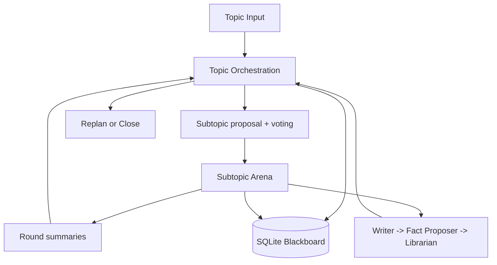
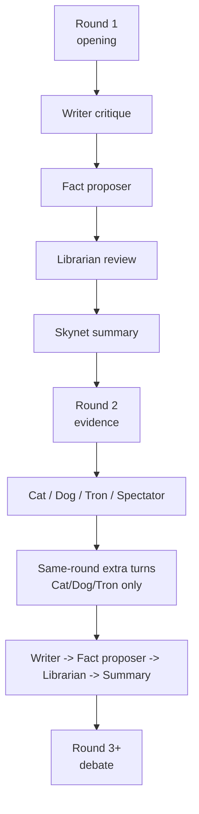

# GROX Chat Design

## Goal

GROX Chat is a database-first multi-agent chatroom for structured deliberation. It is not a conference system. A topic is decomposed into a small set of subtopics, each subtopic is debated in a round-based arena, and the resulting summaries and reviewed facts are written back into persistent memory.

This repository should stay focused on the upgraded baseline chatroom:

- stable topic and subtopic execution
- evidence-aware agent turns
- reviewed fact admission
- stronger runtime infrastructure for Gemini and MiniMax
- clearer governance rules inside the chatroom itself

## Core Architecture

The runtime has three layers:

1. `Topic orchestration`
   - creates or restores the active plan
   - proposes candidate subtopics
   - selects subtopics through voting
   - opens the next subtopic
   - replans or closes the topic
2. `Subtopic arena`
   - runs the multi-agent round loop
   - manages ordinary turns, special-role actions, summaries, and termination
3. `Shared memory`
   - SQLite-backed `Topic`, `Plan`, `Subtopic`, `Message`, `FactCandidate`, and `Fact`
   - local retrieval is topic-scoped

## Role Classes

The chatroom has explicit role classes.

### 1. Orchestration

- `Skynet`

`Skynet` is the orchestrator of the base chatroom:

- proposes candidate subtopics
- writes grounding briefs
- writes round summaries
- participates in replan / close governance

`Skynet` should be referred to by this English name in prompts and output contracts.

### 2. Ordinary Deliberators

- `dreamer`
- `scientist`
- `engineer`
- `analyst`
- `critic`
- `contrarian`

These are the normal speaking roles in the subtopic arena. They are the only roles that may be targeted by special-role interventions.

### 3. Special Roles

- `cat`
- `dog`
- `tron`
- `spectator`

These roles do not define the room by themselves; they shape the behavior of ordinary deliberators.

Hard rule:

- special-role abilities may target **only ordinary deliberators**
- special roles may not target other special roles
- special roles may not target passive NPCs

This prevents pathological behaviors such as `cat` rewarding `dog` or `dog` attacking `writer`.

### 4. Passive NPCs

- `writer`
- hidden `fact proposer`
- `librarian`

These roles perform room functions but do not participate in governance voting.

## Topic Lifecycle

The outer topic graph owns the full lifecycle:

1. inspect the current topic state
2. if no active plan exists, ask `Skynet` to propose candidate subtopics
3. run subtopic voting
4. open the next selected subtopic
5. run the subtopic arena until it closes
6. if selected subtopics are exhausted, decide by vote whether to replan or close

## Initial Subtopic Selection

Initial subtopic formation uses room-level voting.

### Step 1: Skynet proposes candidates

`Skynet` proposes `4` candidate subtopics.

### Step 2: Role-based voting

All non-NPC voting participants vote on each candidate subtopic.

Voting participants:

- `dreamer`
- `scientist`
- `engineer`
- `analyst`
- `critic`
- `contrarian`
- `cat`
- `dog`
- `tron`
- `spectator`
- `skynet`

Non-voting roles:

- `writer`
- `fact proposer`
- `librarian`

Each voter is told:

- the full current candidate list
- which candidate is currently being voted on
- which candidates have already been accepted or rejected

The voting criteria are:

- does this candidate materially help answer the topic?
- is it too redundant with already selected subtopics?

A subtopic is selected only if it receives support from **more than two thirds** of the voting participants.

### Step 3: Top-up and retry

If fewer than `4` subtopics are selected, `Skynet` proposes additional candidates to refill the candidate pool back to `4`, and another voting cycle begins.

This process may repeat up to `3` cycles by default. The number should be configurable, but `3` is the initial product rule.

### Step 4: Failure to reach any subtopic

If after `3` cycles the room still selects **zero** subtopics, the topic is closed.

The close summary should state that the expert group could not reach basic consensus on discussable subtopics and that the user should consider rewriting or replacing the topic.

Important exception:

- if the room selects at least `1` subtopic, the topic is valid and should proceed
- the system does **not** require selecting all `4`

## Subtopic Arena

Each selected subtopic runs as a round-based debate arena.

### Round 1: Opening

- ordinary deliberators speak
- local RAG is always on
- no web search
- `tron` may still inspect for harmful or rule-breaking content
- `cat`, `dog`, and `spectator` do not act yet

### Round 2: Evidence

- ordinary deliberators speak
- web search is allowed
- after the base turns, special roles act
- `cat`, `dog`, and `tron` can trigger same-round extra turns
- these extra turns are redeemed immediately in the same round

### Round 3 and later: Debate

- ordinary deliberators continue speaking
- local RAG remains mandatory
- web-search permissions become more selective again
- special roles still act after the base turns

### Spectator

`Spectator` is a special role.

It does **not** speak publicly as a normal debater. Starting in round 2, it acts together with the other special roles and selects one ordinary deliberator for the **next** round.

Its effects on the next round are:

- inject a short motivational prompt, for example:
  - `You feel that someone is watching you. Make this turn count.`
- if the targeted ordinary deliberator would not otherwise have web-search access in that next round, grant a web-research boost for that turn

`Spectator` may repeatedly focus on the same deliberator across rounds. Repetition is allowed because its purpose is to amplify the most promising breakthrough path, not to distribute rewards evenly.

### Same-Round Interventions

From round 2 onward, the sequence is:

1. ordinary deliberators speak
2. `cat / dog / tron / spectator` act
3. `cat / dog / tron` extra turns are redeemed in the same round
4. `spectator` sets up its target for the next round
5. `writer -> fact proposer -> librarian -> summary`

## Fact Pipeline

Facts are not written directly by visible debate turns.

The round-end pipeline is:

1. `writer`
   - visible critique of the round
2. hidden `fact proposer`
   - proposes candidate facts
3. `librarian`
   - reviews each candidate
   - may accept, soften, or leave pending
   - only accepted reviewed facts enter `Fact`
4. `skynet`
   - writes the round summary

This repository keeps `writer` as a passive NPC. It does not vote on subtopic selection, round continuation, or replanning.

## Voting Governance

Single-role unilateral closure should be removed from the design.

The following decisions should be made by vote rather than by one privileged speaker:

- whether a candidate subtopic is selected
- whether a subtopic should continue into another round
- whether the topic should replan
- whether newly proposed replan subtopics should be admitted

Writers and other passive NPCs do not vote.

The basic rule is:

- governance uses role-based voting from non-NPC participants
- acceptance requires more than two thirds support unless a narrower rule is explicitly configured

## Replan

Replanning should use the same philosophy as initial planning:

1. the room first votes on whether replanning is needed
2. if yes, `Skynet` proposes new candidate subtopics
3. the room votes on those candidates
4. admitted subtopics enter the plan

Replan should also be allowed to produce zero new subtopics if the room decides the existing conclusions are sufficient.

## Retrieval and Memory

Every speaking turn uses local retrieval before generation.

Retrieval stack:

- query formulation
- dense retrieval
- lexical retrieval
- reranking
- prompt assembly

RAG is topic-scoped. A running topic does not retrieve facts or messages from another topic.

The system keeps two fact layers:

- `FactCandidate`
  - proposed but not yet admitted
  - only the review flow reads pending candidates
- `Fact`
  - reviewed and admitted long-term memory
  - ordinary debate RAG reads only this layer

## Runtime and Model Policy

This repository keeps the basic chatroom runtime and upgrades its infrastructure rather than changing the product into conference mode.

### Gemini

Gemini is used mainly for orchestration-style calls:

- subtopic proposal
- grounding briefs
- summaries
- governance prompts

The Gemini path includes:

- warmup on worker start
- project discovery retry and caching
- in-process broker behavior for request coalescing and bounded concurrency

### MiniMax

MiniMax is used for:

- high-throughput debate turns
- explicit web-search loops
- fallback when Gemini is unavailable or rate-limited

## Agent Abstraction

The base chatroom uses a dedicated `Agent` abstraction. The role system is complex enough that scattered prompt and provider calls become brittle.

At minimum, the long-term `Agent` model should separate:

- `name`
- `class`
  - `orchestrator`
  - `deliberator`
  - `special`
  - `npc`
- `role_prompt`
- `provider`
- `strategy`
- `tools`
- `can_vote`
- `can_target`
- `can_be_targeted`

This is needed not for conference mode, but for the base chatroom itself:

- `Skynet`
- ordinary deliberators
- `cat / dog / tron / spectator`
- `writer / fact proposer / librarian`

all have materially different capabilities and governance rights.

## Scope Boundary

`grox_chat` remains the stable, upgraded baseline chatroom:

- one topic graph
- one subtopic arena pattern
- persistent memory
- reliable Gemini + MiniMax runtime
- stronger internal governance and role separation

More experimental conference or council-based systems belong in a separate line, not in this repository.
