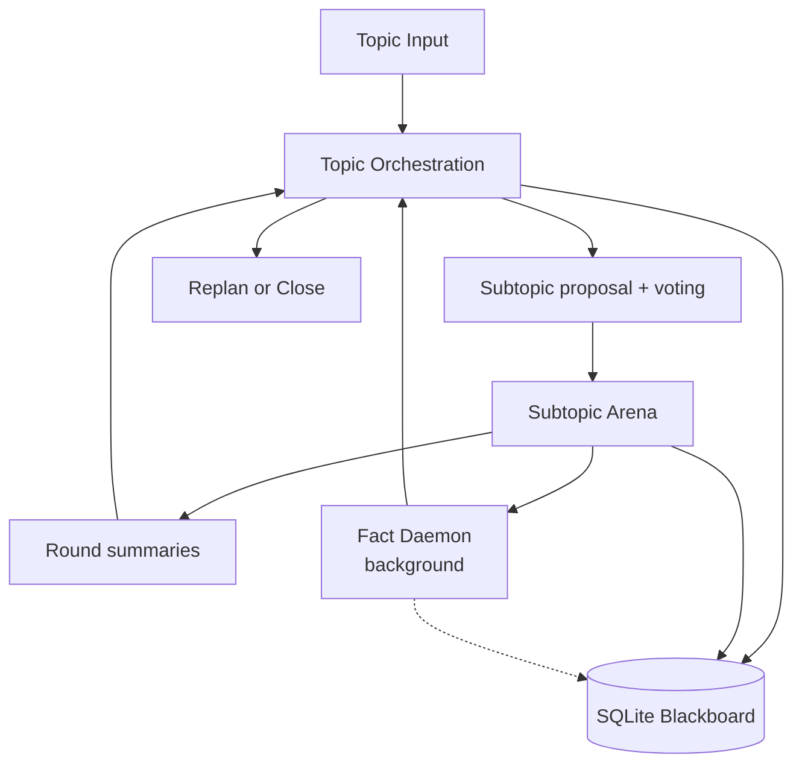

# GROX Chat Design

## Goal

GROX Chat is a database-first multi-agent chatroom for structured deliberation. It is not a conference system. A topic is decomposed into a small set of subtopics, each subtopic is debated in a round-based arena with parallel and sequential execution stages, and the resulting summaries and reviewed facts are written back into persistent memory via a background fact daemon.

This repository should stay focused on the upgraded baseline chatroom:

- stable topic and subtopic execution
- evidence-aware agent turns with citation protocol
- background fact extraction and review via Fact Daemon
- stage-based parallel execution for R1/R2
- stronger runtime infrastructure for Gemini and MiniMax with split concurrency
- clearer governance rules with hard close at Round 7

## Core Architecture

The runtime has three layers:

1. `Topic orchestration`
   - creates or restores the active plan
   - proposes candidate subtopics
   - selects subtopics through voting
   - opens the next subtopic
   - replans or closes the topic
2. `Subtopic arena`
   - runs the multi-agent round loop via stage dispatcher
   - R1/R2: parallel group nodes execute agents concurrently
   - R3+: sequential group node executes agents one at a time with inline interventions
   - manages special-role actions, summaries, and termination
3. `Shared memory`
   - SQLite-backed `Topic`, `Plan`, `Subtopic`, `Message`, `FactCandidate`, `Fact`, `ClaimCandidate`, `Claim`, `WebEvidence`, `VoteRecord`
   - local retrieval is topic-scoped
   - dense embeddings (sqlite-vec) and FTS5 full-text indexes

## Role Classes

The chatroom has explicit role classes.

### 1. Orchestration

- `Skynet`

`Skynet` is the orchestrator of the base chatroom:

- proposes candidate subtopics
- writes grounding briefs
- writes round summaries
- participates in replan / close governance

`Skynet` should be referred to by this English name in prompts and output contracts.

### 2. Ordinary Deliberators

- `dreamer`
- `scientist`
- `engineer`
- `analyst`
- `critic`
- `contrarian`

These are the normal speaking roles in the subtopic arena. They are the only roles that may be targeted by special-role interventions.

### 3. Special Roles

- `cat`
- `dog`
- `tron`
- `spectator`

These roles do not define the room by themselves; they shape the behavior of ordinary deliberators.

Hard rule:

- special-role abilities may target **only ordinary deliberators**
- special roles may not target other special roles
- special roles may not target passive NPCs

This prevents pathological behaviors such as `cat` rewarding `dog` or `dog` attacking `writer`.

### 4. Passive NPCs

- `writer`
- hidden `fact proposer`
- `librarian`

These roles perform room functions but do not participate in governance voting.

## Topic Lifecycle

The outer topic graph owns the full lifecycle:

1. inspect the current topic state
2. if no active plan exists, ask `Skynet` to propose candidate subtopics
3. run subtopic voting
4. open the next selected subtopic
5. run the subtopic arena until it closes
6. if selected subtopics are exhausted, decide by vote whether to replan or close

## Initial Subtopic Selection

Initial subtopic formation uses room-level voting.

### Step 1: Skynet proposes candidates

`Skynet` proposes `4` candidate subtopics.

### Step 2: Role-based voting

All non-NPC voting participants vote on each candidate subtopic.

Voting participants:

- `dreamer`, `scientist`, `engineer`, `analyst`, `critic`, `contrarian`
- `cat`, `dog`, `tron`, `spectator`
- `skynet`

Non-voting roles:

- `writer`, `fact proposer`, `librarian`

A subtopic is selected only if it receives support from **more than two thirds** of the voting participants.

### Step 3: Top-up and retry

If fewer than `4` subtopics are selected, `Skynet` proposes additional candidates to refill the candidate pool back to `4`, and another voting cycle begins. This process may repeat up to `3` cycles.

### Step 4: Failure to reach any subtopic

If after `3` cycles the room still selects **zero** subtopics, the topic is closed.

## Subtopic Arena

Each selected subtopic runs as a round-based debate arena using a **stage dispatcher** pattern.

### Stage-Based Execution

The arena uses `StageSpec` objects that define groups of agents and whether they run in parallel or sequentially. The stage dispatcher pops stages one at a time and routes to either `parallel_group_node` or `sequential_group_node`.

### Round 1: Opening (Parallel)

- Stage 1: builders (dreamer, scientist, engineer, analyst) + tron run **concurrently**
- Stage 2: critic runs alone
- local RAG is always on; no web search
- `cat`, `dog`, and `spectator` do not act yet

### Round 2: Evidence (Parallel)

- Stage 1: builders + cat/tron/spectator run **concurrently**
- Stage 2: critics (critic, contrarian) + dog run **concurrently**
- web search is allowed
- interventions from dog/cat/tron are injected as additional parallel stages

### Round 3+: Debate (Sequential)

- All agents run **sequentially** in roster order
- Interventions fire immediately after the triggering agent's turn
- The `working_state` dict propagates spectator targets to subsequent agents within the same round

### Same-Round Interventions

When `dog`, `cat`, or `tron` targets a deliberator:

- **Parallel mode (R1/R2)**: intervention turns are collected and inserted as a new parallel stage before the remaining stages
- **Sequential mode (R3+)**: intervention turns execute immediately inline after the triggering agent

### End-of-Round Pipeline

After agent turns complete:

1. `writer` — visible critique of the round
2. `skynet` — round summary
3. termination vote (R3+)

### Termination Policy

| Round | Stage | Behavior |
|-------|-------|----------|
| 1-2 | — | No termination vote |
| 3 | Weak | Burden on continuing |
| 4-5 | Medium | Close when disagreement is peripheral |
| 6 | Strong | Burden shifts to closing |
| 7+ | **Forced** | Hard close bypasses voting entirely |

## Fact Daemon

Facts are no longer extracted inline in the round pipeline. A background `FactDaemon` runs continuously during subtopic execution.

### Architecture

The daemon has two concurrent loops:

1. **Clerk loop** (polls every 5s)
   - Fetches new standard messages via `get_messages_since`
   - Extracts number fact candidates (regex-based)
   - Extracts sourced fact candidates via LLM call
   - Extracts claim candidates from cited facts via LLM call

2. **Librarian loop** (polls every 8s)
   - Fetches pending fact and claim candidates
   - Reviews each candidate via LLM (MiniMax primary, Gemini fallback)
   - Accepts, softens, or rejects candidates
   - Generates summaries and embeddings for accepted facts

### Drain Protocol

When a subtopic closes:
1. `drain_daemon_node` signals drain via `_drain` event
2. Clerk finishes current batch and sets `_clerk_done`
3. Librarian waits for `_clerk_done`, does a final sweep, sets `_drain_complete`
4. Daemon tasks are gathered and cleaned up

### Concurrency Isolation

The daemon uses a dedicated MiniMax semaphore (1 slot) via `contextvars.ContextVar`. The main pipeline uses a separate semaphore (N-1 slots). This prevents the daemon from starving agent turns.

## Citation Protocol

The system enforces typed citation markers:

| Marker | Meaning | Evidence Grade | Sanitized |
|--------|---------|---------------|-----------|
| `[F{id}]` | Verified fact | Yes | Yes — stripped if not in RAG context |
| `[C{id}]` | Derived claim | Yes (weaker) | Yes |
| `[W{id}]` | Web evidence | Cite with caveat | Yes |
| `[M{id}]` | Prior message reference | No (attribution only) | No — always allowed |

The `CITATION_ID_PATTERN` regex and `_sanitize_citations_to_allowed_ids` only apply to `[F/C/W]` citations. `[M]` citations are never stripped because they are attribution, not evidence claims.

Message prompts render as `[M43|dreamer] (confidence=7.0/10): content...` so agents can see and reference message IDs.

## Voting Governance

Single-role unilateral closure should be removed from the design.

The following decisions should be made by vote rather than by one privileged speaker:

- whether a candidate subtopic is selected
- whether a subtopic should continue into another round
- whether the topic should replan
- whether newly proposed replan subtopics should be admitted

Writers and other passive NPCs do not vote.

The basic rule is:

- governance uses role-based voting from non-NPC participants
- acceptance requires more than two thirds support unless a narrower rule is explicitly configured

## Retrieval and Memory

Every speaking turn uses local retrieval before generation.

Retrieval stack:

- query formulation (LLM-based, with fallback to raw context)
- dense retrieval (sqlite-vec embeddings)
- lexical retrieval (FTS5)
- cross-encoder reranking (threshold 0.3)
- prompt assembly with citation injection

RAG is topic-scoped. A running topic does not retrieve facts or messages from another topic.

The system keeps multiple data layers:

- `FactCandidate` / `ClaimCandidate` — proposed but not yet admitted; only the review flow reads these
- `Fact` / `Claim` — reviewed and admitted long-term memory; ordinary debate RAG reads these
- `WebEvidence` — cached web search results with 30-day TTL
- `VoteRecord` — all governance votes with reasons

## Runtime and Model Policy

### Gemini

Gemini is used mainly for orchestration-style calls:

- subtopic proposal
- grounding briefs
- summaries
- governance prompts

### MiniMax

MiniMax is used for:

- high-throughput debate turns
- explicit web-search loops (ReAct pattern)
- fallback when Gemini is unavailable or rate-limited

### Concurrency Model

MiniMax requests use a split semaphore controlled by `MINIMAX_MAX_CONCURRENT` (default 4):

- Main pipeline: N-1 slots (default 3)
- Fact Daemon: 1 slot (fixed)
- Channel selection via `contextvars.ContextVar` — daemon tasks set `is_daemon_channel=True` at loop entry

## Scope Boundary

`grox_chat` remains the stable, upgraded baseline chatroom:

- one topic graph
- one subtopic arena pattern with parallel/sequential stages
- persistent memory with background fact processing
- reliable Gemini + MiniMax runtime with split concurrency
- stronger internal governance with hard close
- citation protocol with message attribution

More experimental conference or council-based systems belong in a separate line, not in this repository.
