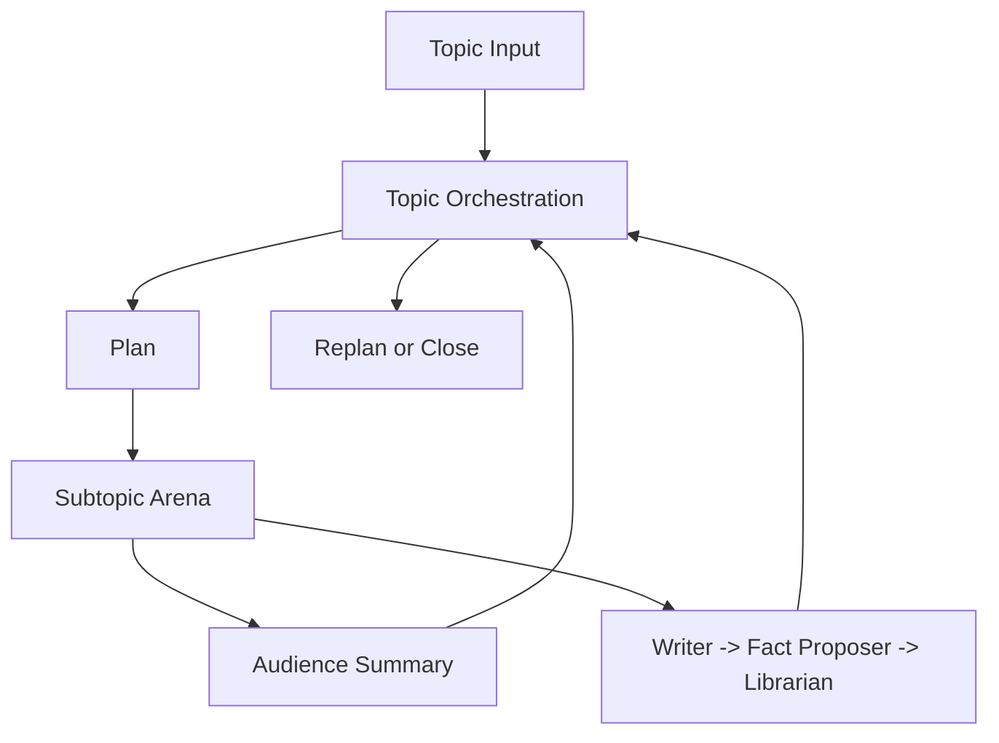
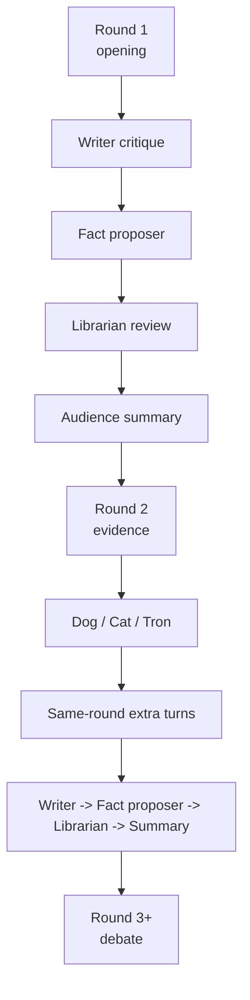

# GROX Chat

Gemini Research Orchestration with minimaX -- Chat Only

[中文说明](README_CN.md)

GROX Chat is the stable, database-first multi-agent chatroom. It runs one topic at a time, breaks that topic into subtopics, executes a round-based debate arena for each subtopic, and writes summaries and reviewed facts back into SQLite memory.

This repository is intentionally the **base chatroom**, not the conference-mode branch.

## What It Does

- plans up to a small set of subtopics for each topic
- runs a structured multi-agent debate loop
- keeps local RAG on every speaking turn
- uses `Dog / Cat / Tron` for same-round interventions
- separates critique, fact proposal, and fact admission
- supports Gemini-first orchestration with MiniMax fallback

## Runtime Shape

The system has two major loops:

1. `Topic orchestration`
   - generate or restore a plan
   - open the next subtopic
   - conclude the subtopic
   - replan or close when the current plan is exhausted
2. `Subtopic arena`
   - runs `opening -> evidence -> debate`
   - applies round-end critique, fact proposal, fact review, and summary



## Arena Roles

Debate roles:

- `dreamer`
- `scientist`
- `engineer`
- `analyst`
- `critic`
- `contrarian`

Intervention roles:

- `dog`
- `cat`
- `tron`

Functional roles:

- `writer`
- hidden `fact proposer`
- `librarian`
- `audience`

## Round Flow

- `Round 1`
  - deliberators speak
  - local RAG is always on
  - no web search
- `Round 2`
  - deliberators may use web search
  - `dog / cat / tron` act
  - extra turns are redeemed in the same round
- `Round 3+`
  - debate continues with local RAG always on
  - web-search permissions narrow again



## Memory Model

The SQLite blackboard stores:

- `Topic`
- `Plan`
- `Subtopic`
- `Message`
- `FactCandidate`
- `Fact`

Important rules:

- normal RAG reads only reviewed `Fact`
- pending `FactCandidate` rows are hidden from ordinary debate turns
- topic-scoped retrieval prevents cross-topic contamination

## Model Routing

- Gemini is used mainly for orchestration and summaries
- MiniMax is used for high-throughput debate and web-search loops
- Gemini runtime now includes warmup, project discovery retry, request coalescing, and bounded concurrency
- Gemini failures fall back to MiniMax when possible

## Project Layout

- `src/grox_chat/`: orchestration, clients, retrieval, persistence, prompts, web monitor
- `tests/`: unit and integration tests
- `DESIGN.md`: base chatroom design

## Quick Start

```bash
uv sync
cp .env.example .env
uv run python -c "from grox_chat.db import init_db; init_db()"
uv run python -m grox_chat.server
```

Create a topic from another shell:

```bash
uv run python -c "from grox_chat.api import create_topic; create_topic('Topic summary', 'Detailed topic prompt')"
```

Run tests:

```bash
uv run pytest -q
```

## MiniMax Endpoint Selection

- Default host: mainland `https://api.minimaxi.com`
- Set `MINIMAX_EN=1` in `.env` to use international `https://api.minimax.io`
- This applies to both:
  - Anthropic-compatible Messages API
  - Coding Plan search API
