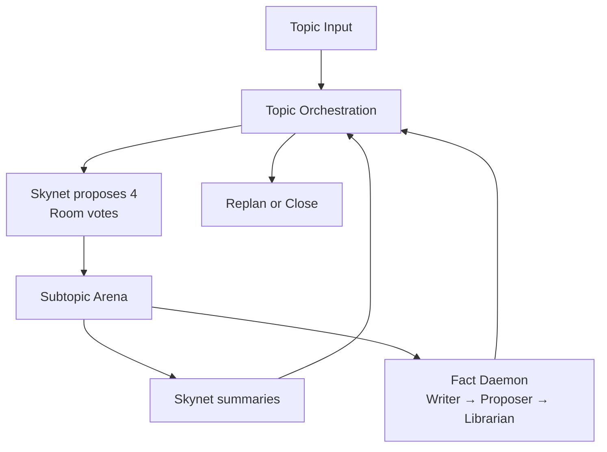
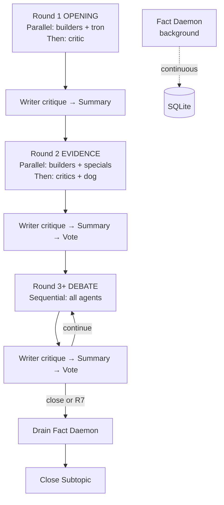

# GROX Chat

Gemini Research Orchestration with minimaX -- Chat Only

[中文说明](README_CN.md)

GROX Chat is a database-first multi-agent chatroom for structured deliberation. It runs one topic at a time, proposes and votes on candidate subtopics, debates each admitted subtopic in a round-based arena with parallel agent execution, and writes summaries plus reviewed facts back into SQLite memory via a background fact daemon.

This repository is intentionally the **base chatroom**, not the conference-mode branch.

## What It Does

- lets `Skynet` propose candidate subtopics and admit them through room voting
- runs a structured multi-agent debate loop with **stage-based parallel execution** (R1/R2 concurrent, R3+ sequential)
- keeps local RAG on every speaking turn
- uses `Dog / Cat / Tron / Spectator` as non-debate intervention roles
- runs a **background Fact Daemon** for continuous fact extraction and librarian review
- supports `[M{id}]` message citations so agents reference prior arguments by ID instead of paraphrasing
- routes Gemini, MiniMax, and web-search calls through one in-process broker with **split semaphore** (main pipeline / daemon)
- documents every RAG section so `[F...]` (verified facts), `[C...]` (derived claims), `[M...]` (message attribution), `[W...]` (web evidence) carry their intended meaning, enforces citation IDs only when provided in the injected prompt, and caches `[W...]` rows for 30 days under a higher rerank threshold before they reach the clerk

## Runtime Shape

The system has three layers:

1. `Topic orchestration`
   - create or restore the active plan
   - let `Skynet` propose 4 candidate subtopics
   - admit subtopics by vote
   - open the next selected subtopic
   - replan or close when selected work is exhausted
2. `Subtopic arena`
   - run `opening -> evidence -> debate`
   - R1/R2: agents execute in parallel stages
   - R3+: agents execute sequentially with immediate interventions
   - background Fact Daemon extracts and reviews facts continuously
   - hard close at Round 7 if voting doesn't converge
3. `Shared memory`
   - persist `Topic`, `Plan`, `Subtopic`, `Message`, `FactCandidate`, `Fact`, `ClaimCandidate`, `Claim`, `WebEvidence`, `VoteRecord`
   - keep retrieval scoped to the current topic



## Role Classes

Orchestrator:

- `skynet`

Ordinary deliberators:

- `dreamer`
- `scientist`
- `engineer`
- `analyst`
- `critic`
- `contrarian`

Special roles:

- `dog`
- `cat`
- `tron`
- `spectator`

Passive NPCs:

- `writer`
- hidden `fact proposer`
- `librarian`

Hard rule:

- special-role abilities may target only ordinary deliberators
- special roles may not target other specials or passive NPCs
- passive NPCs never vote

## Governance

Initial subtopic admission is no longer a unilateral orchestrator decision.

- `Skynet` proposes 4 candidate subtopics
- all non-NPC voting participants vote on each candidate
- a candidate passes only with more than 2/3 support
- if fewer than 4 are admitted, `Skynet` refills the pool back to 4
- this repeats for up to 3 cycles by default
- if all 3 cycles still produce 0 admitted subtopics, the topic closes
- if at least 1 subtopic is admitted, the topic proceeds normally

Round continuation and replanning use the same voting principle instead of a single-role close decision.

### Termination Policy

| Round | Stage | Behavior |
|-------|-------|----------|
| 1-2 | — | No termination vote |
| 3 | Weak | Burden of proof is on continuing |
| 4-5 | Medium | Close only when disagreement is peripheral |
| 6 | Strong | Burden of proof shifts to closing |
| 7+ | **Forced** | Hard close, no vote needed |

## Round Flow

### Parallel Execution (R1/R2)

- `Round 1 (OPENING)`: builders (dreamer, scientist, engineer, analyst) + tron run **in parallel** → then critic alone
- `Round 2 (EVIDENCE)`: builders + cat/tron/spectator **in parallel** → then critics + dog **in parallel**
- Interventions (dog correction, cat expansion, tron remediation) are injected as a parallel stage between the existing stages

### Sequential Execution (R3+)

- `Round 3+ (DEBATE)`: all agents run sequentially; interventions fire immediately after the triggering agent's turn

### End-of-Round Pipeline

After each round completes:

1. `writer` — visible critique of the round
2. `skynet` — round summary
3. termination vote (R3+)

The **Fact Daemon** runs continuously in the background (not in the round pipeline):
- Clerk loop polls for new messages, extracts number facts and sourced fact candidates
- Librarian loop reviews pending candidates, accepts/softens/rejects them



## Citation Protocol

| Marker | Meaning | Evidence Grade |
|--------|---------|---------------|
| `[F{id}]` | Verified fact | Yes |
| `[C{id}]` | Derived claim supported by facts | Yes (weaker) |
| `[W{id}]` | Unverified web search result | Cite with caveat |
| `[M{id}]` | Prior message attribution | No (context only) |

Agents use `[M{id}]` to reference prior arguments instead of paraphrasing them. The citation sanitizer strips hallucinated `[F/C/W]` IDs but does not strip `[M]` citations.

## Memory Model

The SQLite blackboard stores:

- `Topic`, `Plan`, `Subtopic`
- `Message` (with dense embeddings and FTS5)
- `FactCandidate`, `Fact` (with dense embeddings and FTS5)
- `ClaimCandidate`, `Claim`
- `WebEvidence`
- `VoteRecord`

Important rules:

- normal RAG reads only reviewed `Fact` and `Claim`
- pending `FactCandidate` / `ClaimCandidate` rows are hidden from ordinary debate turns
- topic-scoped retrieval prevents cross-topic contamination

## Model Routing

- Gemini is used mainly for orchestration and summaries
- MiniMax is used mainly for debate and web-search loops
- all provider and search calls are routed through a shared in-process broker
- the broker handles warmup, project discovery retry, request coalescing, bounded concurrency, and provider fallback
- MiniMax concurrency is split into **main** (N-1 slots) and **daemon** (1 slot) channels via `contextvars`, preventing the background daemon from starving the debate pipeline

## Project Layout

- `src/grox_chat/`: orchestration, agents, clients, retrieval, persistence, prompts, web monitor, fact daemon
- `tests/`: unit and integration tests
- `DESIGN.md`: base chatroom design
- `.claude/commands/`: custom Claude Code skills (e.g., `grox-code-review`)

## Quick Start

```bash
uv sync
cp .env.example .env
uv run python -c "from grox_chat.db import init_db; init_db()"
uv run python -m grox_chat.server
```

Environment notes:

- `ENABLE_GEMINI=0` is the default in `.env.example`
- Set `ENABLE_GEMINI=1` in `.env` only if you want real Gemini Pro/Flash calls
- When Gemini is disabled, Gemini profiles automatically fall back to MiniMax
  - `allow_web=False`: MiniMax no-web deep fallback (`plan -> draft -> reflect`)
  - `allow_web=True`: MiniMax web research flow

Create a topic from another shell:

```bash
uv run python -c "from grox_chat.api import create_topic; create_topic('Topic summary', 'Detailed topic prompt')"
```

Run tests:

```bash
uv run pytest -q
```

## Environment Variables

| Variable | Default | Description |
|----------|---------|-------------|
| `MINIMAX_API_KEY` | — | MiniMax API key (required) |
| `MINIMAX_EN` | `0` | `1` = international endpoint `api.minimax.io` |
| `ENABLE_GEMINI` | `0` | `1` = enable Gemini orchestration calls |
| `FAST_MODE` | `0` | `1` = enable fast mode |
| `MINIMAX_MAX_CONCURRENT` | `4` | Max concurrent MiniMax API requests (main gets N-1, daemon gets 1) |
