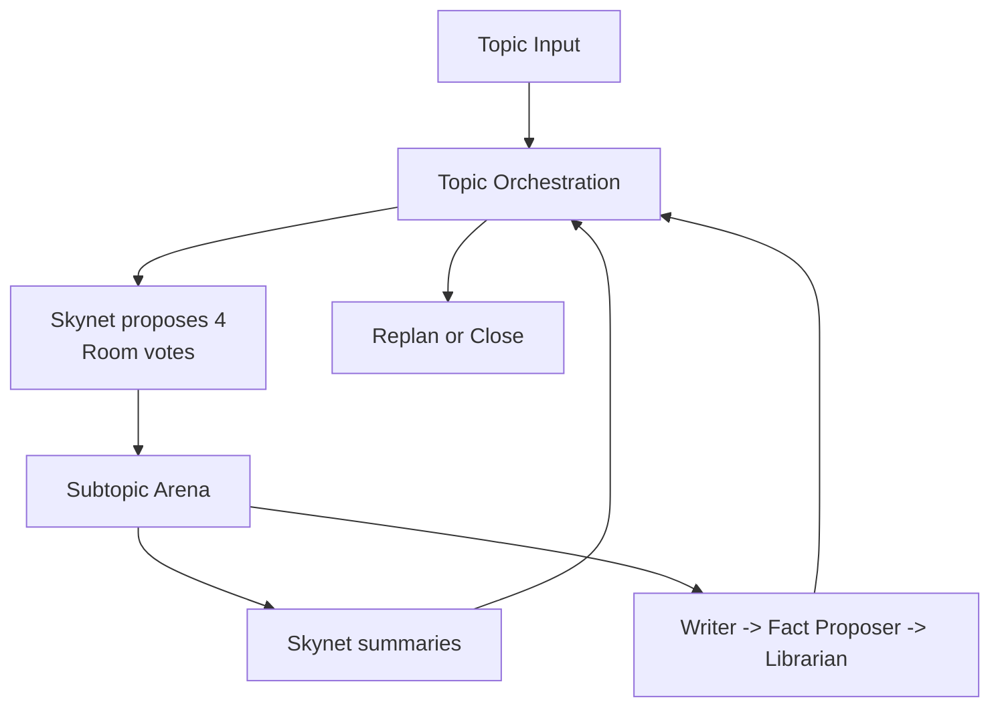
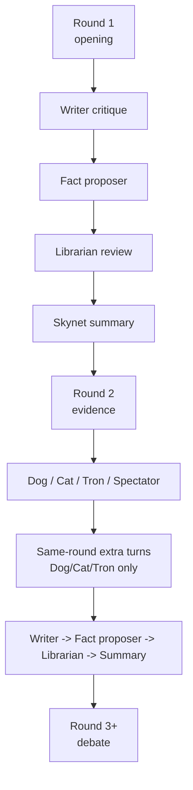

# GROX Chat

Gemini Research Orchestration with minimaX -- Chat Only

[中文说明](README_CN.md)

GROX Chat is the stable, database-first multi-agent chatroom. It runs one topic at a time, proposes and votes on candidate subtopics, debates each admitted subtopic in a round-based arena, and writes summaries plus reviewed facts back into SQLite memory.

This repository is intentionally the **base chatroom**, not the conference-mode branch.

## What It Does

- lets `Skynet` propose candidate subtopics and admit them through room voting
- runs a structured multi-agent debate loop
- keeps local RAG on every speaking turn
- uses `Dog / Cat / Tron / Spectator` as non-debate intervention roles
- separates critique, fact proposal, and fact admission
- routes Gemini, MiniMax, and web-search calls through one in-process broker surface

## Runtime Shape

The system has three layers:

1. `Topic orchestration`
   - create or restore the active plan
   - let `Skynet` propose 4 candidate subtopics
   - admit subtopics by vote
   - open the next selected subtopic
   - replan or close when selected work is exhausted
2. `Subtopic arena`
   - run `opening -> evidence -> debate`
   - apply special-role actions
   - write critique, fact proposals, fact reviews, and summaries
3. `Shared memory`
   - persist `Topic`, `Plan`, `Subtopic`, `Message`, `FactCandidate`, and `Fact`
   - keep retrieval scoped to the current topic



## Role Classes

Orchestrator:

- `skynet`

Ordinary deliberators:

- `dreamer`
- `scientist`
- `engineer`
- `analyst`
- `critic`
- `contrarian`

Special roles:

- `dog`
- `cat`
- `tron`
- `spectator`

Passive NPCs:

- `writer`
- hidden `fact proposer`
- `librarian`

Hard rule:

- special-role abilities may target only ordinary deliberators
- special roles may not target other specials or passive NPCs
- passive NPCs never vote

## Governance

Initial subtopic admission is no longer a unilateral orchestrator decision.

- `Skynet` proposes 4 candidate subtopics
- all non-NPC voting participants vote on each candidate
- a candidate passes only with more than 2/3 support
- if fewer than 4 are admitted, `Skynet` refills the pool back to 4
- this repeats for up to 3 cycles by default
- if all 3 cycles still produce 0 admitted subtopics, the topic closes
- if at least 1 subtopic is admitted, the topic proceeds normally

Round continuation and replanning use the same voting principle instead of a single-role close decision.

## Round Flow

- `Round 1`
  - deliberators speak
  - local RAG is always on
  - no web search
  - `tron` may still inspect
- `Round 2`
  - deliberators may use web search
  - `dog / cat / tron / spectator` act
  - `dog / cat / tron` extra turns are redeemed in the same round
  - `spectator` chooses one deliberator for a next-round focus boost
- `Round 3+`
  - debate continues with local RAG always on
  - web-search permissions narrow again
  - `spectator` may grant a next-round focus and web-search boost



## Memory Model

The SQLite blackboard stores:

- `Topic`
- `Plan`
- `Subtopic`
- `Message`
- `FactCandidate`
- `Fact`

Important rules:

- normal RAG reads only reviewed `Fact`
- pending `FactCandidate` rows are hidden from ordinary debate turns
- topic-scoped retrieval prevents cross-topic contamination

## Model Routing

- Gemini is used mainly for orchestration and summaries
- MiniMax is used mainly for debate and web-search loops
- all provider and search calls are routed through a shared in-process broker
- the broker handles warmup, project discovery retry, request coalescing, bounded concurrency, and provider fallback

## Project Layout

- `src/grox_chat/`: orchestration, agents, clients, retrieval, persistence, prompts, web monitor
- `tests/`: unit and integration tests
- `DESIGN.md`: base chatroom design
- `PLAN.md`: staged implementation plan for the baseline rewrite

## Quick Start

```bash
uv sync
cp .env.example .env
uv run python -c "from grox_chat.db import init_db; init_db()"
uv run python -m grox_chat.server
```

Create a topic from another shell:

```bash
uv run python -c "from grox_chat.api import create_topic; create_topic('Topic summary', 'Detailed topic prompt')"
```

Run tests:

```bash
uv run pytest -q
```

## MiniMax Endpoint Selection

- Default host: mainland `https://api.minimaxi.com`
- Set `MINIMAX_EN=1` in `.env` to use international `https://api.minimax.io`
- This applies to both:
  - Anthropic-compatible Messages API
  - Coding Plan search API
