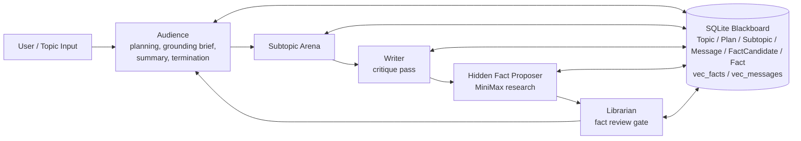
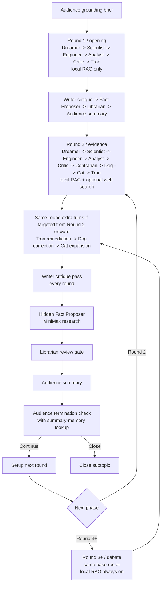

# GROX Chat

Gemini Research Orchestration with minimaX -- Chat Only

[中文说明](README_CN.md)

A database-first, graph-orchestrated reasoning system for long-running technical discussion.

### Overview

GROX Chat is not a free-form group chat. It is a structured reasoning arena built around a persistent SQLite blackboard, with Gemini-led orchestration, Gemini Flash round-end critique, and MiniMax-driven debate and fact research turns.

- `Audience` plans the topic, opens each subtopic with a grounding brief, summarizes progress, and decides when to stop.
- The expert panel drives the actual reasoning: `Dreamer`, `Scientist`, `Engineer`, `Analyst`, `Critic`, and `Contrarian`.
- `Cat`, `Dog`, and `Tron` form the asynchronous validation layer.
- `Writer` produces round-end critique and correction.
- A hidden `Fact Proposer` node uses MiniMax research to draft candidate facts.
- `Librarian` verifies candidate facts before they enter permanent memory.
- Retrieval is explicit: agents decide what to query, then run embedding, search, rerank, and injection before speaking.

### Execution Model

- Every speaking role performs local RAG before generating a message.
- `Round 1 / opening`: `Dreamer -> Scientist -> Engineer -> Analyst -> Critic -> Tron`
- `Round 2 / evidence`: `Dreamer -> Scientist -> Engineer -> Analyst -> Critic -> Contrarian -> Dog -> Cat -> Tron`, with same-round extra turns redeemed at the tail if `Dog` / `Cat` / `Tron` nominate a target
- `Round 3+ / debate`: same base roster, and same-round extra turns remain enabled in fixed order `Tron -> Dog -> Cat`
- External web search is phase-gated: disabled in round 1, open to all speakers in round 2, and narrowed again in round 3+
- `Writer` runs at the end of every round as a critique node
- A hidden `Fact Proposer` runs immediately after `Writer` and drafts up to `2` candidates (`3` on the final pass)
- `Librarian` runs after that and only reviewed facts enter the fact store
- Subtopic termination is graduated: rounds `1-2` cannot close, round `3` uses a weak close check, rounds `4-6` use a medium check, rounds `7-9` use a strong check, and round `10` forces closure
- Initial planning is capped at `3` subtopics; replanning only happens after the current plan is exhausted and may add at most `2` new subtopics

### Architecture



### Subtopic Round Pipeline



### Roles

- `Audience`: moderator, planner, summarizer, and topic-level controller.
- `Writer`: round-end critic and correction layer.
- `Fact Proposer`: hidden MiniMax research node that drafts candidate facts without posting to the room.
- `Librarian`: permanent-memory gatekeeper; accepts, softens, or rejects candidate facts.
- `Dreamer`: proposes new directions and hypotheses.
- `Scientist`: checks mechanism, theory, and internal validity.
- `Engineer`: converts ideas into buildable systems and concrete tactics.
- `Analyst`: contributes metrics, uncertainty estimates, and data framing.
- `Critic`: stress-tests claims and attacks weak reasoning.
- `Contrarian`: deliberately challenges the emerging consensus.
- `Cat`: rewards the strongest contribution with an extra turn.
- `Dog`: punishes the weakest claim with a forced re-verification turn.
- `Tron`: enforces forum laws around hallucination, bias, and logical safety.

### Retrieval and Memory

The system maintains a gated long-term memory stack:

- `FactCandidate`: hidden fact-proposer claims waiting for Librarian review.
- `Fact RAG`: reusable, verified knowledge admitted by `Librarian`.
- `Summary RAG`: historical summaries used by `Audience` to detect repetition, stalling, and semantic loops.

The intended retrieval path runs before every speaking turn:

1. Formulate a role-specific query.
2. Embed the query.
3. Retrieve candidate memories from the local vector store.
4. Rerank them with a cross-encoder.
5. Inject the top evidence into the next prompt.

### Repository Layout

- `src/grox_chat/`: orchestration, LLM clients, retrieval, persistence, prompts
- `tests/`: unit and integration tests
- `DESIGN.md`: full design description

### Quick Start

```bash
uv sync
cp .env.example .env
uv run python -c "from grox_chat.db import init_db; init_db()"
uv run python -m grox_chat.server
```

### MiniMax Endpoint Selection

- Default MiniMax API host is the mainland endpoint: `https://api.minimaxi.com`
- Set `MINIMAX_EN=1` in `.env` to use the international endpoint: `https://api.minimax.io`
- This applies to both:
  - Anthropic-compatible Messages API
  - Coding Plan search API
- For MiniMax MCP / IDE integrations, the documented domestic bases are:
  - Anthropic-compatible: `https://api.minimaxi.com/anthropic/v1`
  - OpenAI-compatible: `https://api.minimaxi.com/v1`

Create a topic from another shell:

```bash
uv run python -c "from grox_chat.api import create_topic; create_topic('Topic summary', 'Detailed topic prompt')"
```

### Smoke Test

Use a deliberately absurd but neutral topic:

```bash
uv run python -c "from grox_chat.api import create_topic; create_topic('From a workplace-practice perspective, should an employee enter with the left foot or the right foot?', 'From a workplace-practice perspective, should an employee enter with the left foot or the right foot?')"
```

Inspect the live state from another shell:

```bash
uv run python -c "import sqlite3; conn = sqlite3.connect('chatroom.db'); print(conn.execute('select count(*) from Subtopic').fetchone()[0], conn.execute('select count(*) from Message').fetchone()[0], conn.execute('select count(*) from Fact').fetchone()[0])"
```

Run tests:

```bash
uv run pytest -q
```
