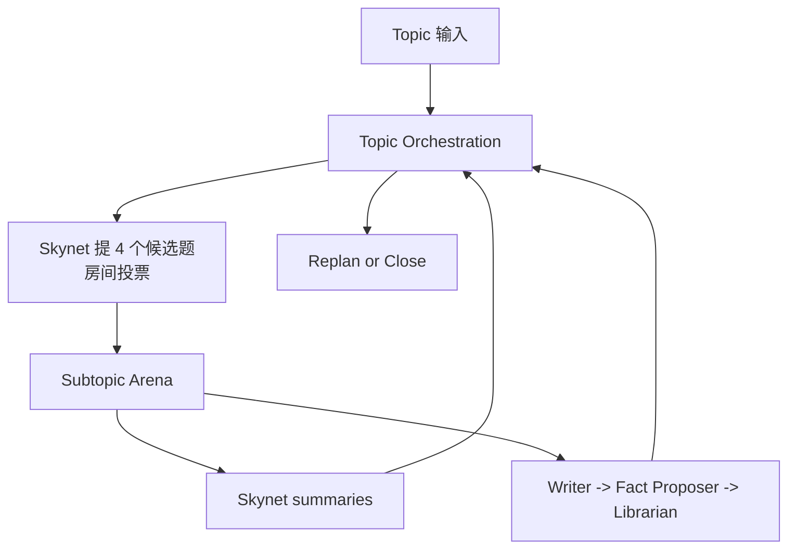
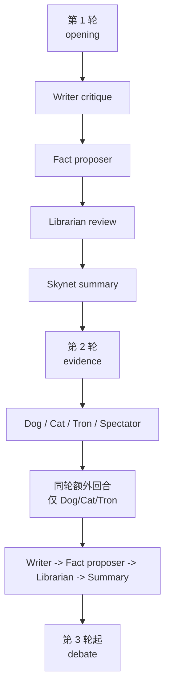

# GROX Chat

Gemini Research Orchestration with minimaX -- Chat Only

[English](README.md)

GROX Chat 是稳定版、数据库优先的多代理 chatroom。它一次运行一个 topic，先提出并投票选择 candidate subtopics，再在每个通过的 subtopic 中执行回合制讨论，并把 summary 和审核后的 facts 写回 SQLite 记忆层。

这个仓库现在明确只做 **基础 chatroom**，不承载 conference-mode 的实验设计。

## 系统能力

- 由 `Skynet`（天网）提出 candidate subtopics，并通过房间投票决定进入讨论的子题
- 运行结构化 multi-agent debate loop
- 每个发言回合都做本地 RAG
- 使用 `Dog / Cat / Tron / Spectator`（狗 / 猫 / 创 / 观众）做干预
- 将 critique、fact proposal、fact admission 分离
- 通过统一 broker 路由 Gemini、MiniMax 和 web-search 调用
- 将 RAG 结果分成 `[F...]`（经过审核的事实）、`[C...]`（基于事实的导出结论）、`Summary`、`Message` 和 `[W...]`（未经审核的网页线索），并确保只有在当前回合注入过的 ID 才能被引用，30 天内的 `[W...]` 结果保留在缓存，并使用更高的 rerank 阈值送给 clerk。

## 运行结构

系统有三层：

1. `Topic orchestration`
   - 创建或恢复 active plan
   - 让 `Skynet` 提出 4 个 candidate subtopics
   - 通过投票决定进入讨论的子题
   - 打开下一个已选 subtopic
   - 在已选工作用尽后决定 replan 或 close
2. `Subtopic arena`
   - 运行 `opening -> evidence -> debate`
   - 管理普通发言、特殊角色行动、summary 和 fact pipeline
3. `Shared memory`
   - 持久化 `Topic`、`Plan`、`Subtopic`、`Message`、`FactCandidate`、`Fact`
   - 检索严格按当前 topic 隔离



## 角色分类

治理角色：

- `skynet`（天网）

普通讨论者：

- `dreamer`（空想家）
- `scientist`（科学家）
- `engineer`（工程师）
- `analyst`（数据分析师）
- `critic`（批评家）
- `contrarian`（少数派）

特殊角色：

- `dog`（狗）
- `cat`（猫）
- `tron`（创）
- `spectator`（观众）

被动 NPC：

- `writer`（作家）
- 隐藏的 `fact proposer`（书记员）
- `librarian`（图书管理员）

硬规则：

- 特殊角色只能 target 普通讨论者
- 特殊角色不能 target 其他特殊角色或被动 NPC
- 被动 NPC 不参与投票

## 治理规则

初始 subtopic 选择不再由单一 orchestrator 直接决定。

- `Skynet` 提 4 个 candidate subtopics
- 所有非 NPC 投票参与者逐个对候选题投票
- 一个 candidate 只有在支持票超过 2/3 时才通过
- 如果通过的少于 4 个，`Skynet` 会把候选池补回 4 个
- 默认最多重复 3 个 cycle
- 如果 3 个 cycle 后仍然 0 个通过，则关闭 topic
- 只要至少通过 1 个 subtopic，就正常进入讨论

每轮是否继续以及是否需要 replan，也使用同样的投票治理，而不是单点裁决。

## 回合流程

- `Round 1`
  - deliberators 正常发言
  - 本地 RAG 始终开启
  - 不开 web search
  - `tron` 仍可做安全检查
- `Round 2`
  - deliberators 可使用 web search
  - `dog / cat / tron / spectator` 行动
  - `dog / cat / tron` 额外回合同轮兑现
  - `spectator` 为下一轮设置 focus boost
- `Round 3+`
  - debate 继续
  - 本地 RAG 始终开启
  - web-search 权限重新收紧
  - `spectator` 仍可提供下一轮聚焦和搜索强化



## 记忆模型

SQLite 黑板保存：

- `Topic`
- `Plan`
- `Subtopic`
- `Message`
- `FactCandidate`
- `Fact`

关键规则：

- 普通 RAG 只读取已审核的 `Fact`
- `FactCandidate` 对普通讨论不可见
- topic-scoped retrieval 防止跨 topic 串题

## 模型路由

- Gemini 主要用于 orchestration 和 summary
- MiniMax 主要用于 debate 和 web-search loop
- 所有 provider 和搜索调用都经过统一的进程内 broker
- broker 负责 warmup、project discovery retry、请求合并、并发上限和 provider fallback

## 项目结构

- `src/grox_chat/`：调度、agents、模型客户端、检索、持久化、prompt、web monitor
- `tests/`：单元测试与集成测试
- `DESIGN.md`：基础 chatroom 设计
- `PLAN.md`：基础版重构的阶段计划

## 快速开始

```bash
uv sync
cp .env.example .env
uv run python -c "from grox_chat.db import init_db; init_db()"
uv run python -m grox_chat.server
```

环境说明：

- `.env.example` 默认是 `ENABLE_GEMINI=0`
- 只有在 `.env` 中设置 `ENABLE_GEMINI=1` 时，才会真正调用 Gemini Pro/Flash
- Gemini 关闭时，Gemini profile 会自动退化到 MiniMax
  - `allow_web=False`：走 MiniMax 的无联网深度 fallback（`plan -> draft -> reflect`）
  - `allow_web=True`：走 MiniMax 的 web research 流程

在另一个终端创建 topic：

```bash
uv run python -c "from grox_chat.api import create_topic; create_topic('主题摘要', '更详细的主题描述')"
```

运行测试：

```bash
uv run pytest -q
```

## MiniMax 接入点

- 默认使用国内 MiniMax：`https://api.minimaxi.com`
- 如果在 `.env` 中设置 `MINIMAX_EN=1`，则切换到国际版：`https://api.minimax.io`
- 如果在 `.env` 中设置 `ENABLE_GEMINI=1`，则启用 Gemini；否则所有 Gemini 请求都会退化到 MiniMax fallback
- 该开关同时影响：
  - Anthropic 兼容 Messages API
  - Coding Plan Search API
