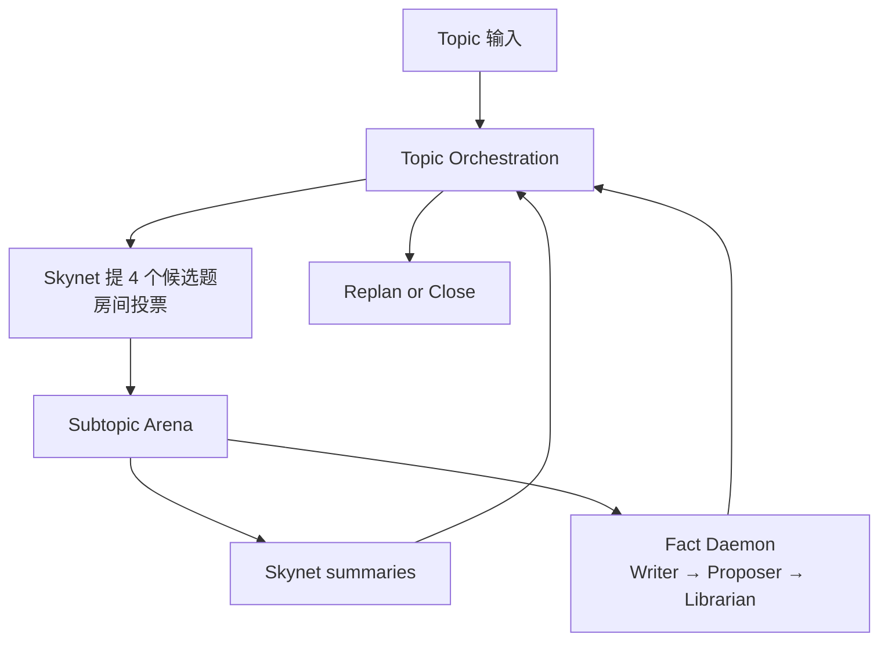
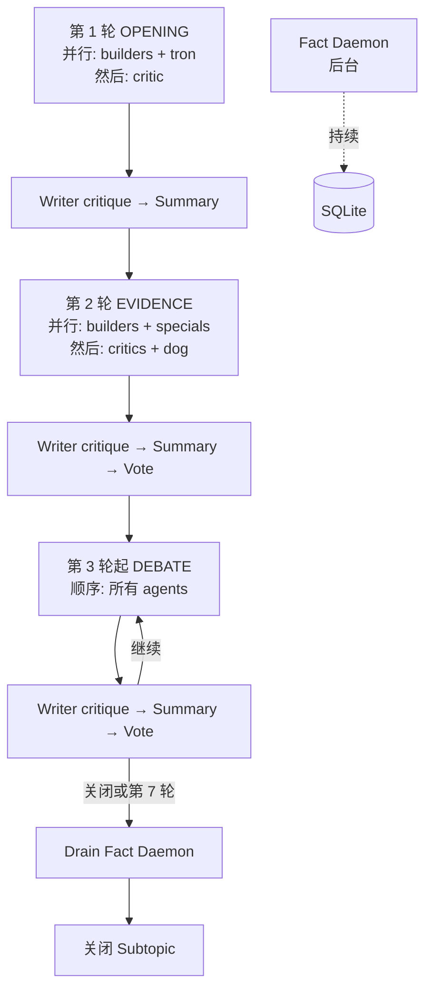

# GROX Chat

Gemini Research Orchestration with minimaX -- Chat Only

[English](README.md)

GROX Chat 是稳定版、数据库优先的多代理 chatroom。它一次运行一个 topic，先提出并投票选择 candidate subtopics，再在每个通过的 subtopic 中执行回合制讨论（R1/R2 并行、R3+ 顺序），并通过后台 Fact Daemon 持续提取和审核 facts，写回 SQLite 记忆层。

这个仓库现在明确只做 **基础 chatroom**，不承载 conference-mode 的实验设计。

## 系统能力

- 由 `Skynet`（天网）提出 candidate subtopics，并通过房间投票决定进入讨论的子题
- 运行结构化 multi-agent debate loop，支持 **阶段式并行执行**（R1/R2 并发，R3+ 顺序）
- 每个发言回合都做本地 RAG
- 使用 `Dog / Cat / Tron / Spectator`（狗 / 猫 / 创 / 观众）做干预
- 后台运行 **Fact Daemon**，持续提取和审核事实候选
- 支持 `[M{id}]` 消息引用协议，agents 通过 ID 引用前人观点而非复述
- 通过统一 broker 路由 Gemini、MiniMax 和 web-search 调用，**分离信号量**（主管线 / daemon）
- 将 RAG 结果分成 `[F...]`（经过审核的事实）、`[C...]`（基于事实的导出结论）、`[M...]`（消息归因）、`[W...]`（未经审核的网页线索），并确保只有在当前回合注入过的 ID 才能被引用

## 运行结构

系统有三层：

1. `Topic orchestration`
   - 创建或恢复 active plan
   - 让 `Skynet` 提出 4 个 candidate subtopics
   - 通过投票决定进入讨论的子题
   - 打开下一个已选 subtopic
   - 在已选工作用尽后决定 replan 或 close
2. `Subtopic arena`
   - 运行 `opening -> evidence -> debate`
   - R1/R2：agents 在并行阶段中执行
   - R3+：agents 顺序执行，干预立即触发
   - 后台 Fact Daemon 持续提取和审核事实
   - 第 7 轮强制关闭（如果投票未收敛）
3. `Shared memory`
   - 持久化 `Topic`、`Plan`、`Subtopic`、`Message`、`FactCandidate`、`Fact`、`ClaimCandidate`、`Claim`、`WebEvidence`、`VoteRecord`
   - 检索严格按当前 topic 隔离



## 角色分类

治理角色：

- `skynet`（天网）

普通讨论者：

- `dreamer`（空想家）
- `scientist`（科学家）
- `engineer`（工程师）
- `analyst`（数据分析师）
- `critic`（批评家）
- `contrarian`（少数派）

特殊角色：

- `dog`（狗）
- `cat`（猫）
- `tron`（创）
- `spectator`（观众）

被动 NPC：

- `writer`（作家）
- 隐藏的 `fact proposer`（书记员）
- `librarian`（图书管理员）

硬规则：

- 特殊角色只能 target 普通讨论者
- 特殊角色不能 target 其他特殊角色或被动 NPC
- 被动 NPC 不参与投票

## 治理规则

初始 subtopic 选择不再由单一 orchestrator 直接决定。

- `Skynet` 提 4 个 candidate subtopics
- 所有非 NPC 投票参与者逐个对候选题投票
- 一个 candidate 只有在支持票超过 2/3 时才通过
- 如果通过的少于 4 个，`Skynet` 会把候选池补回 4 个
- 默认最多重复 3 个 cycle
- 如果 3 个 cycle 后仍然 0 个通过，则关闭 topic
- 只要至少通过 1 个 subtopic，就正常进入讨论

每轮是否继续以及是否需要 replan，也使用同样的投票治理，而不是单点裁决。

### 终止策略

| 轮次 | 阶段 | 行为 |
|------|------|------|
| 1-2 | — | 不进行终止投票 |
| 3 | 弱 | 继续的举证责任在继续方 |
| 4-5 | 中等 | 仅当分歧是外围或重复时才关闭 |
| 6 | 强 | 举证责任转移到关闭方 |
| 7+ | **强制** | 硬关闭，不需要投票 |

## 回合流程

### 并行执行（R1/R2）

- `Round 1 (OPENING)`：builders（dreamer, scientist, engineer, analyst）+ tron **并行执行** → 然后 critic 单独执行
- `Round 2 (EVIDENCE)`：builders + cat/tron/spectator **并行** → 然后 critics + dog **并行**
- 干预（dog correction, cat expansion, tron remediation）作为额外并行阶段注入

### 顺序执行（R3+）

- `Round 3+ (DEBATE)`：所有 agents 顺序执行；干预在触发 agent 发言后立即触发

### 轮末流程

每轮结束后：

1. `writer` — 本轮讨论的可见 critique
2. `skynet` — 本轮 summary
3. 终止投票（R3+）

**Fact Daemon** 在后台持续运行（不在轮末管线中）：
- Clerk 循环轮询新消息，提取数字事实和来源事实候选
- Librarian 循环审核待处理候选，接受/弱化/拒绝



## 引用协议

| 标记 | 含义 | 证据等级 |
|------|------|----------|
| `[F{id}]` | 经审核的事实 | 是 |
| `[C{id}]` | 基于事实的导出结论 | 是（较弱） |
| `[W{id}]` | 未审核的网页搜索结果 | 引用需注明未验证 |
| `[M{id}]` | 前序消息归因 | 否（仅上下文） |

Agents 使用 `[M{id}]` 引用前人观点而非复述。引用清理器会剥离虚构的 `[F/C/W]` ID，但不会剥离 `[M]` 引用。

## 记忆模型

SQLite 黑板保存：

- `Topic`、`Plan`、`Subtopic`
- `Message`（含稠密嵌入和 FTS5）
- `FactCandidate`、`Fact`（含稠密嵌入和 FTS5）
- `ClaimCandidate`、`Claim`
- `WebEvidence`
- `VoteRecord`

关键规则：

- 普通 RAG 只读取已审核的 `Fact` 和 `Claim`
- `FactCandidate` / `ClaimCandidate` 对普通讨论不可见
- topic-scoped retrieval 防止跨 topic 串题

## 模型路由

- Gemini 主要用于 orchestration 和 summary
- MiniMax 主要用于 debate 和 web-search loop
- 所有 provider 和搜索调用都经过统一的进程内 broker
- broker 负责 warmup、project discovery retry、请求合并、并发上限和 provider fallback
- MiniMax 并发通过 `contextvars` 分为 **主管线**（N-1 slot）和 **daemon**（1 slot），防止后台 daemon 抢占讨论管线带宽

## 项目结构

- `src/grox_chat/`：调度、agents、模型客户端、检索、持久化、prompt、web monitor、fact daemon
- `tests/`：单元测试与集成测试
- `DESIGN.md`：基础 chatroom 设计
- `.claude/commands/`：自定义 Claude Code skills（如 `grox-code-review`）

## 快速开始

```bash
uv sync
cp .env.example .env
uv run python -c "from grox_chat.db import init_db; init_db()"
uv run python -m grox_chat.server
```

环境说明：

- `.env.example` 默认是 `ENABLE_GEMINI=0`
- 只有在 `.env` 中设置 `ENABLE_GEMINI=1` 时，才会真正调用 Gemini Pro/Flash
- Gemini 关闭时，Gemini profile 会自动退化到 MiniMax
  - `allow_web=False`：走 MiniMax 的无联网深度 fallback（`plan -> draft -> reflect`）
  - `allow_web=True`：走 MiniMax 的 web research 流程

在另一个终端创建 topic：

```bash
uv run python -c "from grox_chat.api import create_topic; create_topic('主题摘要', '更详细的主题描述')"
```

运行测试：

```bash
uv run pytest -q
```

## 环境变量

| 变量 | 默认值 | 说明 |
|------|--------|------|
| `MINIMAX_API_KEY` | — | MiniMax API 密钥（必填） |
| `MINIMAX_EN` | `0` | `1` = 国际端点 `api.minimax.io` |
| `ENABLE_GEMINI` | `0` | `1` = 启用 Gemini |
| `FAST_MODE` | `0` | `1` = 启用快速模式 |
| `MINIMAX_MAX_CONCURRENT` | `4` | 最大 MiniMax 并发请求数（主管线 N-1，daemon 1） |
