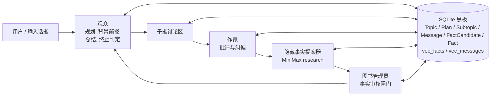
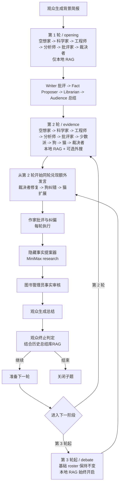

# GROX Chat

Gemini Research Orchestration with minimaX -- Chat Only

[English](README.md)

一个以数据库为中心、由图状态机调度的推理系统，面向长时间、多阶段的技术讨论与知识沉淀。

### 系统简介

GROX Chat 不是普通的多人闲聊，而是一个围绕 SQLite 持久化黑板运行的结构化推理竞技场；Gemini 负责高层调度和轮末批评总结，MiniMax 负责高吞吐讨论与事实研究。

- `观众 (Audience)` 负责总体规划、为每个子题撰写背景简报、总结进度，并决定何时终止。
- 专家组负责推动核心推理：`空想家 (Dreamer)`、`科学家 (Scientist)`、`工程师 (Engineer)`、`分析师 (Analyst)`、`批评家 (Critic)` 和 `少数派 (Contrarian)`。
- `猫 (Cat)`、`狗 (Dog)` 和 `裁决者 (Tron)` 组成异步的验证与反馈层。
- `作家 (Writer)` 负责轮末批判与纠偏。
- 一个隐藏的 `事实提案器 (Fact Proposer)` 会用 MiniMax research 产生候选事实。
- `图书管理员 (Librarian)` 负责审核候选事实，决定哪些内容能进入永久记忆。
- 检索是显式的：代理会先决定查询什么，然后执行向量化、搜索、重排，最后才开始发言。

### 执行模型

- 每个发言角色在生成消息前都必须先走一遍本地 RAG。
- `第 1 轮 / opening`：`空想家 -> 科学家 -> 工程师 -> 分析师 -> 批评家 -> 裁决者`
- `第 2 轮 / evidence`：`空想家 -> 科学家 -> 工程师 -> 分析师 -> 批评家 -> 少数派 -> 狗 -> 猫 -> 裁决者`，如果 `狗 / 猫 / 裁决者` 点名成功，会在**同一轮队尾**立即兑现额外回合
- `第 3 轮起 / debate`：基础 roster 与第二轮相同，同轮补时机制继续开启，顺序固定为 `裁决者 -> 狗 -> 猫`
- 外部 web search 按 phase 控制：第一轮关闭，第二轮全员可选，第三轮起只对特定角色开放
- `作家 (Writer)` 每轮末都会执行，只负责批判与纠偏
- 隐藏的 `事实提案器 (Fact Proposer)` 紧跟在 Writer 之后执行，普通轮最多提出 `2` 条候选事实，final pass 最多 `3` 条
- `图书管理员 (Librarian)` 紧跟在 Fact Proposer 之后执行，只有审核通过或被弱化后的事实才进入 Fact 表
- subtopic 终止采用分级强度：第 `1-2` 轮禁止关闭，第 `3` 轮弱检查，第 `4-6` 轮中等检查，第 `7-9` 轮强检查，第 `10` 轮强制关闭
- 初始规划最多 `3` 个 subtopics；只有当前 plan 用尽后才会 replan，而且每次最多新增 `2` 个 subtopics

### 系统架构



### 子题循环工作流



### 角色分配

- `观众 (Audience)`：主持人、规划者、总结者和话题层级的总控。
- `作家 (Writer)`：轮末批评者与纠偏者。
- `事实提案器 (Fact Proposer)`：隐藏的 MiniMax research 节点，只负责提出候选事实，不向聊天室发可见消息。
- `图书管理员 (Librarian)`：永久记忆守门员；负责接受、弱化或拒绝候选事实。
- `空想家 (Dreamer)`：提出新方向和大胆假设。
- `科学家 (Scientist)`：检验机制、理论和内部有效性。
- `工程师 (Engineer)`：把想法转成可实现系统和执行路径。
- `分析师 (Analyst)`：提供指标、概率、不确定性和数据视角。
- `批评家 (Critic)`：强力攻击漏洞、边界条件和逻辑断裂。
- `少数派 (Contrarian)`：主动反对正在形成的主流共识。
- `猫 (Cat)`：挑出最有价值的发言，并给予额外回合（奖励）。
- `狗 (Dog)`：挑出最可疑的发言，并强制其补充自证（惩罚）。
- `裁决者 (Tron)`：执行论坛法则，处理严重幻觉、偏置和逻辑失控。

### 检索与记忆

系统维护一个带审核闸门的长期记忆栈：

- `FactCandidate`：由隐藏 `Fact Proposer` 提出的、等待 `Librarian` 审核的候选事实。
- `Fact RAG`：由 `Librarian` 审核通过后进入长期记忆的可复用硬事实。
- `Summary RAG`：历史总结记忆，用于检测重复、停滞和语义回环。

理想检索路径会在每次发言前执行：

1. 先根据当前角色和争论生成检索问题。
2. 对问题做 embedding 向量化。
3. 从本地向量库召回候选记忆。
4. 用 reranker 交叉编码器精排。
5. 把最相关证据注入下一次发言的 prompt。

### 项目结构

- `src/grox_chat/`: 调度、模型客户端、检索、持久化、prompt
- `tests/`: 单元测试与集成测试
- `DESIGN.md`: 完整设计文档

### 快速开始

```bash
uv sync
cp .env.example .env
uv run python -c "from grox_chat.db import init_db; init_db()"
uv run python -m grox_chat.server
```

### MiniMax 接入点切换

- 默认使用国内 MiniMax API：`https://api.minimaxi.com`
- 如果在 `.env` 中设置 `MINIMAX_EN=1`，则切到国际版：`https://api.minimax.io`
- 这个开关同时影响：
  - Anthropic 兼容 Messages API
  - Coding Plan 搜索 API
- 对于 MiniMax MCP / IDE 类接入，官方文档给出的国内基址是：
  - Anthropic 兼容：`https://api.minimaxi.com/anthropic/v1`
  - OpenAI 兼容：`https://api.minimaxi.com/v1`

另开一个终端创建 topic：

```bash
uv run python -c "from grox_chat.api import create_topic; create_topic('主题摘要', '更详细的主题描述')"
```

### 快速冒烟测试

你可以用一个故意荒谬但中性的题目做快速检查：

```bash
uv run python -c "from grox_chat.api import create_topic; create_topic('从职场实践角度出发，早上进门应该先左脚还是先右脚？', '从职场实践角度出发，早上进门应该先左脚还是先右脚？')"
```

另开一个终端查看数据库状态：

```bash
uv run python -c "import sqlite3; conn = sqlite3.connect('chatroom.db'); print(conn.execute('select count(*) from Subtopic').fetchone()[0], conn.execute('select count(*) from Message').fetchone()[0], conn.execute('select count(*) from Fact').fetchone()[0])"
```

运行测试：

```bash
uv run pytest -q
```
