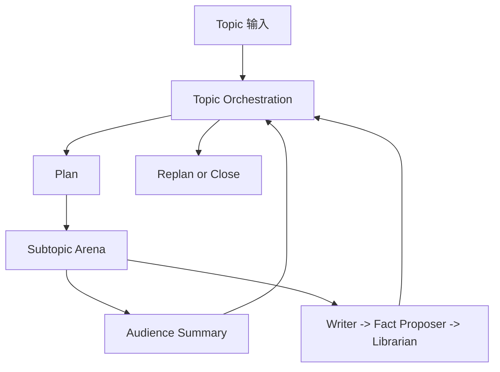
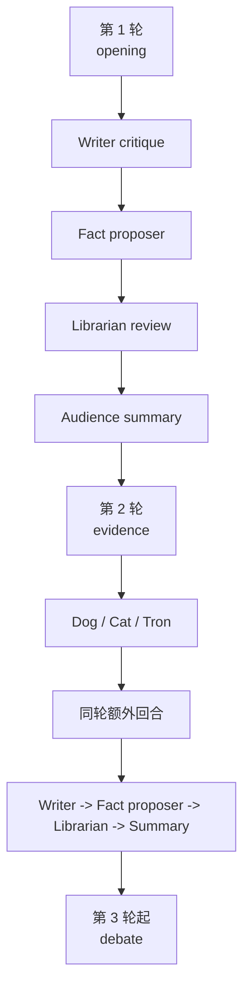

# GROX Chat

Gemini Research Orchestration with minimaX -- Chat Only

[English](README.md)

GROX Chat 是稳定版、数据库优先的多代理 chatroom。它一次运行一个 topic，把 topic 拆成若干 subtopics，在每个 subtopic 里执行回合制讨论，并把 summary 和审核后的 facts 写回 SQLite 记忆层。

这个仓库现在明确只做 **基础 chatroom**，不再承载 conference-mode 的实验设计。

## 系统能力

- 为每个 topic 规划少量 subtopics
- 运行结构化 multi-agent debate loop
- 每个发言回合都做本地 RAG
- 使用 `Dog / Cat / Tron` 做同轮干预
- 将 critique、fact proposal、fact admission 分离
- 使用 Gemini-first orchestration，并在可行时回退到 MiniMax

## 运行结构

系统有两层主循环：

1. `Topic orchestration`
   - 生成或恢复 plan
   - 打开下一个 subtopic
   - 收束 subtopic
   - 在 plan 用尽后决定 replan 或 close
2. `Subtopic arena`
   - 运行 `opening -> evidence -> debate`
   - 在每轮末执行 critique、fact proposal、fact review 和 summary



## 分会场角色

讨论角色：

- `dreamer`
- `scientist`
- `engineer`
- `analyst`
- `critic`
- `contrarian`

干预角色：

- `dog`
- `cat`
- `tron`

功能角色：

- `writer`
- 隐藏 `fact proposer`
- `librarian`
- `audience`

## 回合流程

- `Round 1`
  - deliberators 正常发言
  - 本地 RAG 始终开启
  - 不开 web search
- `Round 2`
  - deliberators 可使用 web search
  - `dog / cat / tron` 行动
  - 额外回合同轮兑现
- `Round 3+`
  - debate 继续
  - 本地 RAG 始终开启
  - web-search 权限重新收紧



## 记忆模型

SQLite 黑板保存：

- `Topic`
- `Plan`
- `Subtopic`
- `Message`
- `FactCandidate`
- `Fact`

关键规则：

- 普通 RAG 只读取已审核的 `Fact`
- `FactCandidate` 对普通讨论不可见
- topic-scoped retrieval 防止跨 topic 串题

## 模型路由

- Gemini 主要用于 orchestration 和 summary
- MiniMax 主要用于高吞吐 debate 和 web-search loop
- Gemini runtime 现在包含 warmup、project discovery retry、请求合并和并发上限
- Gemini 失败时，系统会在可行情况下回退到 MiniMax

## 项目结构

- `src/grox_chat/`：调度、模型客户端、检索、持久化、prompt、web monitor
- `tests/`：单元测试与集成测试
- `DESIGN.md`：基础 chatroom 设计

## 快速开始

```bash
uv sync
cp .env.example .env
uv run python -c "from grox_chat.db import init_db; init_db()"
uv run python -m grox_chat.server
```

在另一个终端创建 topic：

```bash
uv run python -c "from grox_chat.api import create_topic; create_topic('主题摘要', '更详细的主题描述')"
```

运行测试：

```bash
uv run pytest -q
```

## MiniMax 接入点

- 默认使用国内 MiniMax：`https://api.minimaxi.com`
- 如果在 `.env` 中设置 `MINIMAX_EN=1`，则切换到国际版：`https://api.minimax.io`
- 该开关同时影响：
  - Anthropic 兼容 Messages API
  - Coding Plan Search API
